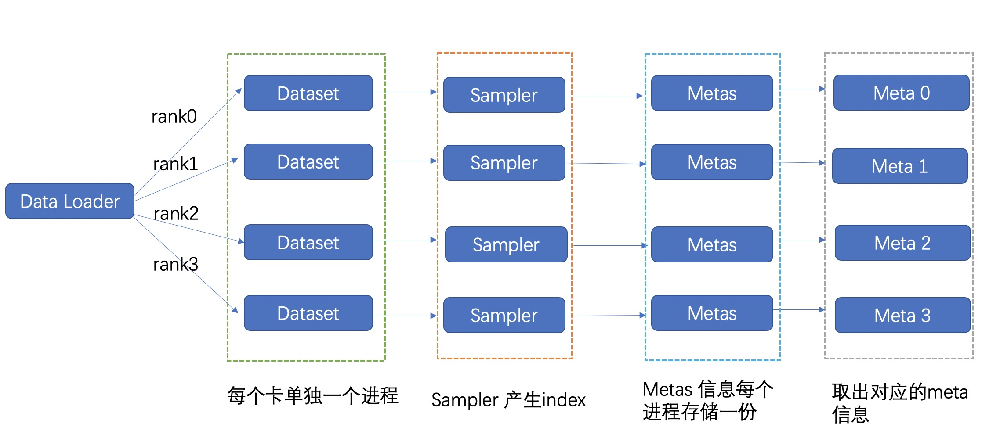
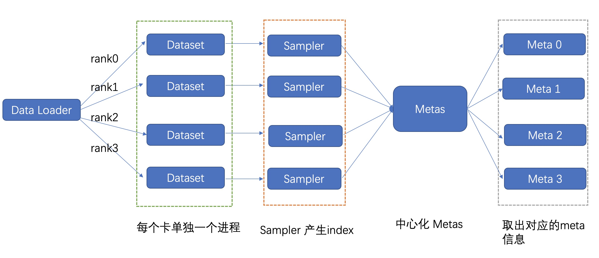
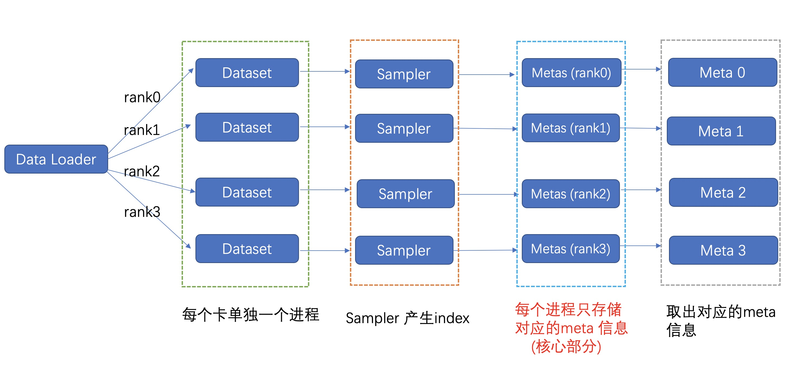
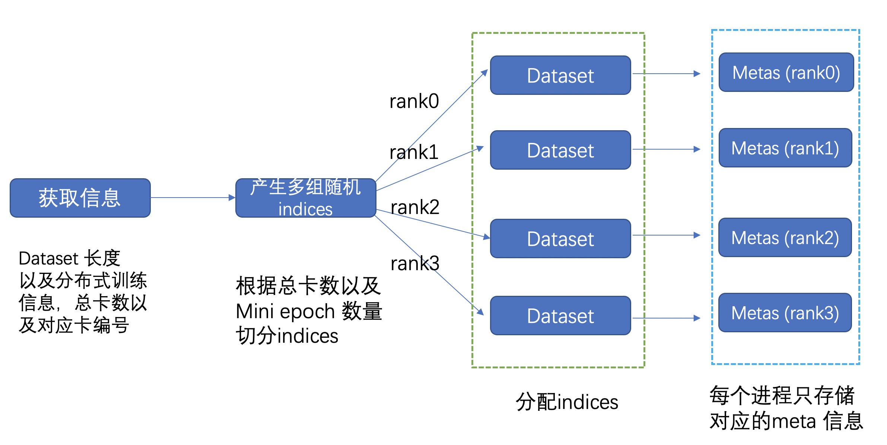
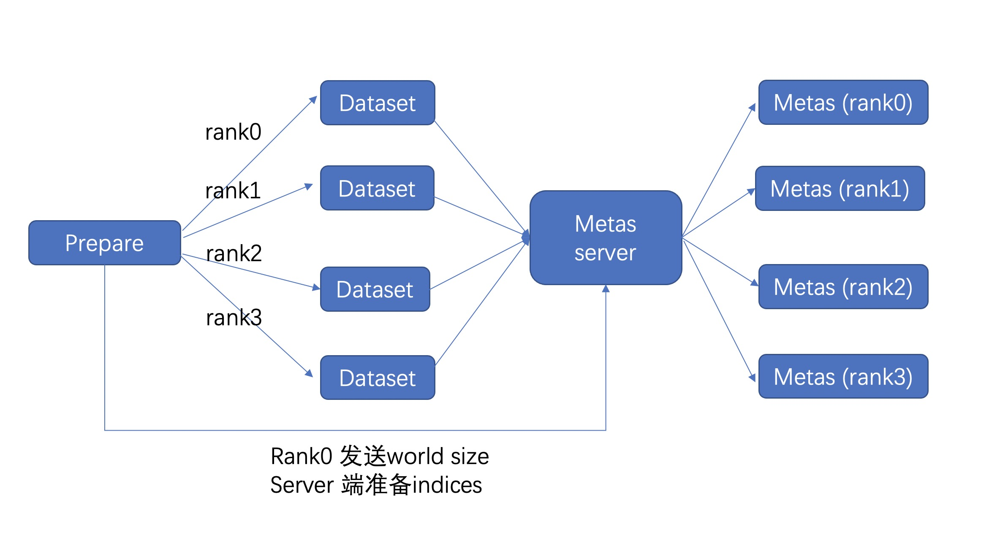

# PyTorch 大规模数据集加载 

## [知乎链接](https://zhuanlan.zhihu.com/p/357809861)

## 问题阐述
对于数据量比较小的数据集，一般来说我们直接加载到内存里即可，不需要考虑内存是否够用的情况。对于大规模数据集（千万级别以上）我们普通的加载方式已经没法满足我们的需求，内存问题已经成为瓶颈之一，因此针对此我们需要作出一些针对性的优化。

### PyTorch的数据集加载背景简单介绍

一般来说我们只需要关注这以下几个部分，dataset 是我们实现的自己数据集的具体原型，继承自torch.dataset, 其getitem 函数负责根据index去拿出我们对应的meta信息，sampler 负责提供想要拿出的index顺序。详细的PyTorch 数据集加载可以阅读官网或者可以看这篇。[Dataset](https://zhuanlan.zhihu.com/p/337850513)



### 具体实现

* 背景介绍

以下为一个最简单的dataset 实现，对于8卡任务因为是多进程，所以实际的进程数量为8, 也就是会有8 * metas 需要在内存里存放(实际考虑到dataloader 的worker 数量，这个实际占用量会更大)，当我们的metas信息比较大的时候，我们的内存就可能会出现溢出问题。

* 普通样例

```python
class BaseDataset(Dataset):
    def __init__(self, meta_file):
        super(BaseDataset, self).__init__()
        self.metas = self.parse(meta_file)

    def parse(self, meta_file):
        metas = []
        with open(meta_file) as f:
            for line in f.readlines():
                metas.append(line.strip())
        return metas

    def __getitem__(self, idx):
        return self.metas[idx]

```

* meta_file 格式
```shell
#filename label (分类任务)
image1.jpg 1
image2.jpg 0
image3.jpg 3
```

* 训练流程

训练数据的流程可以表示如下:

```python
dataset = BaseDataset("/path/to/meta")
sampler = DistributedSampler(datset)
dataloader = DataLoader(
            dataset=dataset,
            batch_size=32,
            shuffle=False,
            num_workers=4,
            sampler=sampler
        )
model = build_model()
for index, batch in enumerate(dataloader):
    image, label = batch
    output = model(image)
    loss = criterion(output, label)
    loss.backward()
    
```

#### 解决方案一

将metas 信息中心化，放到一个中心化的地方进行存储，只保留一份，这样可以存储非常大的metas。然后dataset 从中心化的地方去获取meta信息



* example

```python
class ServerDataset(BaseDataset):
    def __init__(self, meta_file, server_ip, server_port, timeout=1000):
        super(ServerDataset, self).__init__(meta_file)
        self.server_ip = server_ip
        self.server_port = server_port
        self.timeout = timeout
        self.meta_num = self.get_meta_num()

    @retry(stop_max_delay=10, stop_max_attempt_number=10)
    def get_meta_num(self):
        meta_num = requests.get('http://{}:{}/get_len'.format(
            self.server_ip, self.server_port), timeout=self.timeout).json()
        return int(meta_num)

    @retry(stop_max_delay=10, stop_max_attempt_number=10)
    def get_meta(self, idx):
        meta = requests.get('http://{}:{}/get/{}'.format(
            self.server_ip, self.server_port, idx), timeout=self.timeout).json()
        return meta
```

* 训练流程

**启动server**

```shell
python server.py --meta_file="/path/to/meta" --port="10080"

```

**启动训练**

```python
dataset = ServerDataset("/path/to/meta", server_ip="10.10.10.10", server_port="10080")
sampler = DistributedSampler(datset)
dataloader = DataLoader(
            dataset=dataset,
            batch_size=32,
            shuffle=False,
            num_workers=4,
            sampler=sampler
        )
model = build_model()
for index, batch in enumerate(dataloader):
    image, label = batch
    output = model(image)
    loss = criterion(output, label)
    loss.backward()
    
```

* 弊端

这种做法对于qps 在1k以下还比较实用, 但是当我们的训练的总batchsize 特别大的时候这种做法会有明显的瓶颈问题，受限于中心化的读取上限问题，因此此方法具有一定的局限性。


#### 解决方案二
* 背景知识

从原理出发，在分布式训练的过程中，其实每张卡实际使用的数据量为 len(metas) // world_size, 在一般的训练过程中我们为了访问方便，采用sampler 去划分不同的卡读取的index，每块卡还是会保留所有的meta信息，因此这样会导致前面的内存问题。

* 具体方案

我们的方案具体为 分rank + 切分数据集进一步的动态的去加载我们的数据集。如下图所示，在初始化的时候，每块卡只加载其对应的meta信息，这样总体的内存占用率可减少 world_size 倍。为了进一步的减少内存，我们还可以进一步将数据集进行切分，分成 mini_epoch 进行分组读取。两者配合使用，总体的内存减少量可达 world_size * mini_epoch 倍，基本上可以达到我们的需求。

*实际的流程图*


* 切分流程
```python
'''
                     Metas 切分过程, mini_epoch = 2, world_size = 8

    mini_epoch_idx = 0                            mini_epoch_idx = 1
---- ---- ---- ---- ---- ---- ---- ---- | ---- ---- ---- ---- ---- ---- ---- ---- 
rk0  rk1  rk2  rk3  rk4  rk5  rk6  rk7  | rk0  rk1  rk2  rk3  rk4  rk5  rk6  rk7 

每次只加载 len(metas) // (world_size * mini_epoch) 这样我们的内存占用就会可以人为的进行调整

'''
```
* 注意

对于普通的dataloader，随机性一般由sampler进行控制，我们这里由于已经分rank进行加载我们的meta 信息，因此每隔一个epoch我们需要重新分配一次我们每个 rank 的 meta 信息，为了保证随机性，在分配rank的meta信息时，我们就要引入随机性, 以下是从本地读取的样例。

* 本地读取样例



* 训练流程

```python
for epoch_num in range(epoch_num):
    reload_cfg = {"mini_epoch": 1, "seed": epoch_num, "mini_epoch_idx": 0, "group": 1}
    dataset = RankDataset("/path/to/meta", is_test=False, reload_cfg)
    sampler = RandomSampler(datset)
    dataloader = DataLoader(
                dataset=dataset,
                batch_size=32,
                shuffle=False,
                num_workers=4,
                sampler=sampler
            )
```


* server 读取样例

本地读取常常会受限于文件系统的读取效率，在我们的文件系统读取速度比较差的时候整个加载会比较慢，因此提供一个中心化读取方案，适用于网络较快的情况。



**启动server**

```shell
python server.py --meta_file="/path/to/meta" --port="10080"

```

**启动训练**

```python
for epoch_num in range(epoch_num):
    reload_cfg = {"mini_epoch": 1, "seed": epoch_num, "mini_epoch_idx": 0, "group": 1}
    dataset = RankServerDataset("/path/to/meta", server_ip="10.10.10.10", server_port="10080", is_test=False, reload_cfg)
    sampler = RandomSampler(datset)
    dataloader = DataLoader(
                dataset=dataset,
                batch_size=32,
                shuffle=False,
                num_workers=4,
                sampler=sampler
            )
```


**需要注意**
当我们需要切分mini_epoch 的时候，每个mini_epoch 都需要进行重新构建dataloader

* Sampler

这是切分rank 之后的sampler，这里就不再需要区分rank了，meta 已经根据rank进行区分

```python
class RandomSampler(Sampler):
    r"""Samples elements randomly, without replacement.

    Arguments:
        data_source (Dataset): dataset to sample from
    """

    def __init__(self, dataset):
        self.dataset = dataset

    def __iter__(self):
        return iter(torch.randperm(len(self.dataset)).tolist())

    def __len__(self):
        return len(self.dataset)

```

**以下是普通的分布式的sampler**

```python
class DistributedSampler(Sampler):
    def __init__(self, dataset, world_size=None, rank=None):
        if world_size is None:
            world_size = get_world_size()
        if rank is None:
            rank = get_rank()

        self.dataset = dataset
        self.world_size = world_size
        self.rank = rank
        self.num_samples = int(
            math.ceil(len(self.dataset) * 1.0 / self.world_size))
        self.total_size = self.num_samples * self.world_size

    def __iter__(self):
        # deterministically shuffle based on epoch
        g = torch.Generator()
        g.manual_seed(self.epoch)
        indices = list(torch.randperm(len(self.dataset), generator=g))

        # add extra samples to make it evenly divisible
        indices += indices[:(self.total_size - len(indices))]
        assert len(indices) == self.total_size

        # subsample
        offset = self.num_samples * self.rank
        indices = indices[offset:offset + self.num_samples]
        assert len(indices) == self.num_samples

        return iter(indices)

    def __len__(self):
        return self.num_samples
```